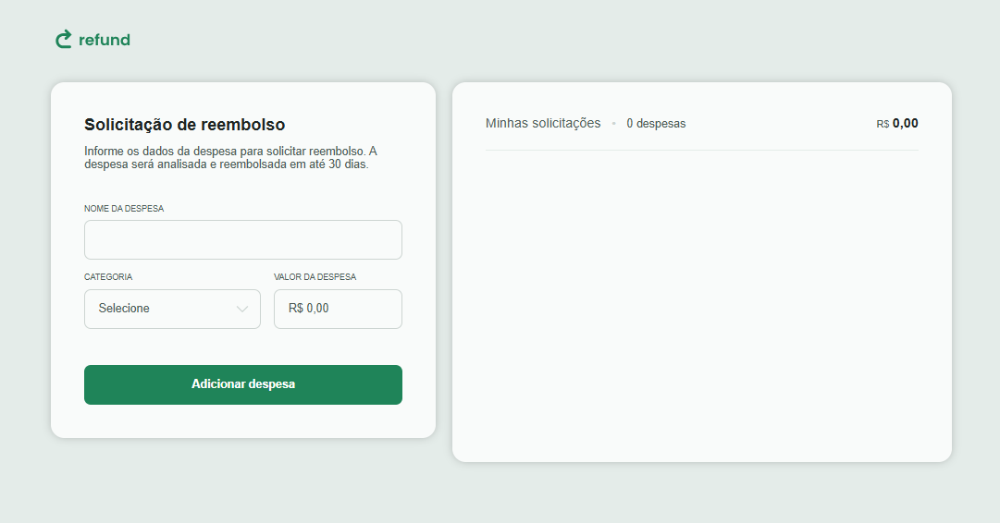
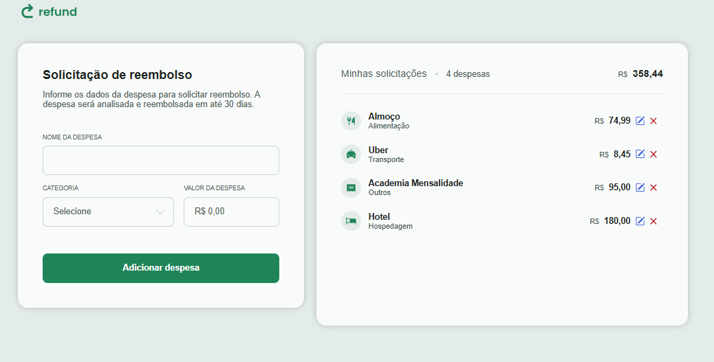

# Projeto Lista de Despesas

## Sobre 👋

Esse projeto aplica um sistema de CRUD completo, abordando funções de criar, ler, atualizar e deletar elementos HTML por meio do JavaScript, simulando uma lista de despesas.

## Tecnologias 🚀

## Acesse aqui🔥
https://jaojogadez.github.io/refund-project/

## Entre em contato ou envie um feedback 💬

 Desenvolvido por <a href="https://github.com/jaojogadez">João Pedro de Oliveira</a> 

